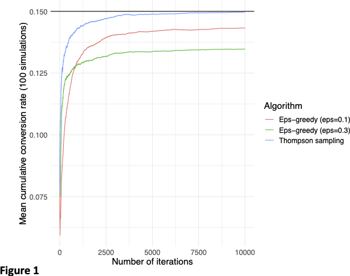
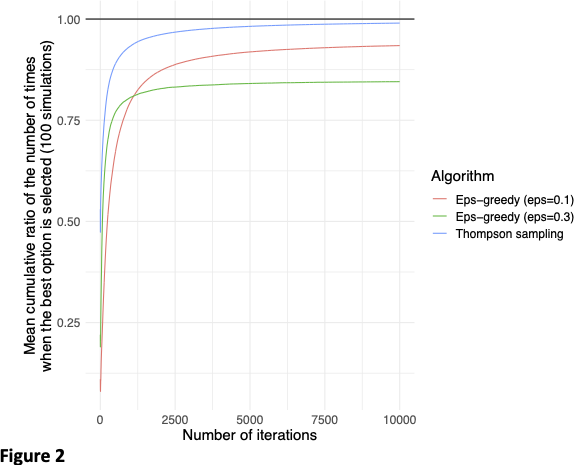
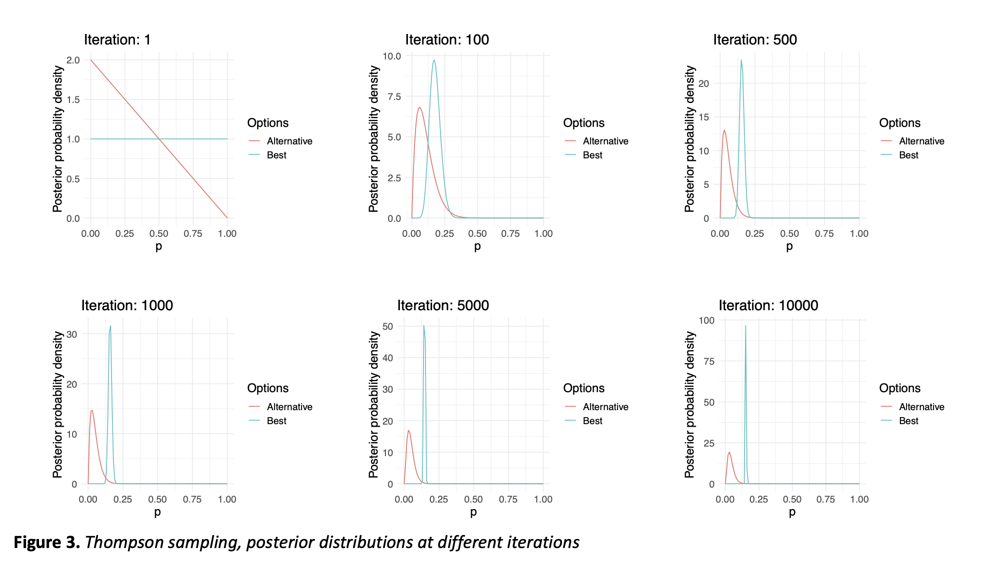

# Multi-Armed Bandit Problem

Multi-armed bandit problem is a well-known problem in machine learning in which one wants to allocate resources among multiple options so that the total gain is maximized. The expected gain from each option is usually not known in advance. For example, one may need to know which of the several online advertisements will lead to the highest conversion rate, or, which of the certain drugs will have the highest treatment effect. 

In traditional AB testing, one needs to first determine the required sample sizes based on the assumed effect sizes. Then, a sample of observations need to be collected from each alternative option, and finally hypothesis testing can be applied to test whether the options are different from each other or not. However, this approach usually results in inefficient allocation of resources as significant fraction of resources is spent on the suboptimal alternatives. Furthermore, in the case of wrong assumptions of effect sizes, the number of samples collected might still not be enough to detect a statistically significant difference between the options.

Another approach, which is known as online learning, offers an adaptive technique to solve this problem by adjusting the allocation of resources in a sequential manner by using the information learned from data one step at a time. There are several approaches, but here I will include two of them:

1) __Epsilon-greedy algorithm__: Starting with zero gain for each option, one of the options is chosen randomly and its expected gain is updated based on the observed data. Later, at each iteration, the option which has the maximum expected gain at that point is chosen with probability of ($1 - \epsilon$) (exploitation), whereas one of the remaining options which have the suboptimal expected gain at that point is chosen randomly with probability of $\epsilon$ (exploration). After enough number of iterations, the overall expected gain is expected to converge to the maximum expected gain.
2) __Thompson sampling__: Using a Bayesian approach, a prior distribution is assumed for the expected gain of each option and a random number is generated from each prior. The option which generated the maximum number is chosen and the data is obtained from the selected option. With each observed data from a particular option, its posterior distribution is obtained and is used as the prior distribution of the expected gain for that particular option in the next iteration. After enough number of iterations, algorithm starts to favor the optimal option and the overall expected gain converges to the maximum expected gain. 

Let us consider the scenario of online advertising, and simulate two options for advertisements (or, bandits) which have conversion rates of 0.05 and 0.15. We can use Bernoulli distribution with parameter p=0.05 for option 1 (named as "alternative option") and p=0.15 for option 2 (names as "best option").
In real life, we don't know these conversion rates in advance, but we would like to learn which option yields higher conversion rate, and also allocate our resources to that option as much as possible while we learn. The two types of online learning algorithms were implemented in the R scripts [epsilon_greedy.R](https://github.com/topahande/multi-armed-bandit/blob/main/epsilon_greedy.R) and [thompson_sampling.R](https://github.com/topahande/multi-armed-bandit/blob/main/thompson_sampling.R). In [thompson_sampling.R](https://github.com/topahande/multi-armed-bandit/blob/main/thompson_sampling.R), prior distributions for parameter p were initialized to Beta(1,1), which is equivalent to Uniform(0,1), for each option.

Figures below were obtained by averaging the results from 100 simulations (using the script [bayesian_ab_testing.R](https://github.com/topahande/multi-armed-bandit/blob/main/bayesian_ab_testing.R)). As we can see from Figure 1, epsilon greedy algorithm with larger epsilon converged more quickly than the one with smaller epsilon. However, its final conversion rate is smaller. This is expected as it had more chance to explore all options including the suboptimal ones, hence the final conversion rate is weighed down by the effects of the suboptimal option selected throughout the learning algorithm. On the other hand, as the epsilon-greedy algorithm with the smaller epsilon had smaller chance to explore the suboptimal option, it converged to a higher conversion rate although it took longer to converge. Overall, we see that Thompson sampling converged to the highest conversion rate and the most quickly. This is due to the Bayesian approach, which enabled the algorithm to quickly learn and consistently favor the best option (see Figure 2) as soon as the posterior distribution of the best option's conversion rate has gotten confident enough (see Figure 3).

